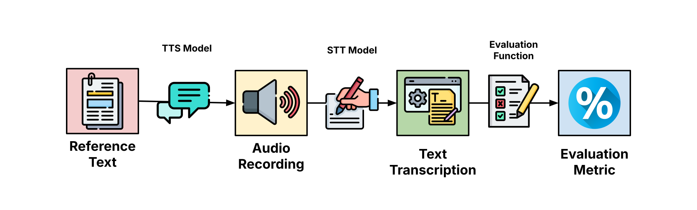
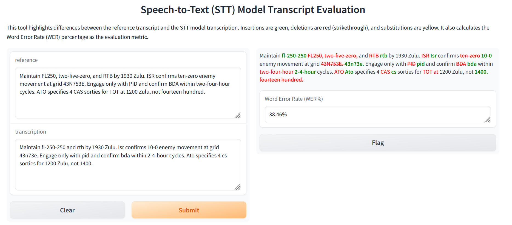

# stt_evaluate: Comparing Speech-to-Text Model Performance



The **stt_evaluate** pipeline evaluates speech-to-text model performances with the following pipeline:

1. Source a reference text. For example, this can be an aerial mission planning worksheet.
2. Convert a reference text to 16kHz `.wav` audio using OpenAI Text-to-Speech (TTS).
3. Select an Speech-to-Text (STT) model to convert the audio to a text transcription. 
4. Run an evaluation function between the **reference** text and the **transcription** text.
5. Calculate the evaluation metric (e.g., WER%, Rouge)

You can interactively compare reference text with transcription text with the built-in Gradio app for Step 5, should you choose to prefer that.

```
python highlight_stt.py
```



## Featured Models

This repository evaluates speech-to-text model performances against one another. Currently, the repository compares:

- [moonshine-base](https://huggingface.co/UsefulSensors/moonshine-base)
- [whisper-base.en](https://huggingface.co/openai/whisper-base.en)
- [whisper-tiny.en](https://huggingface.co/openai/whisper-tiny.en)

I plan to add tests for the following models later:

- [whisperX](https://github.com/m-bain/whisperX)
- TBA

## File Navigation

- [archive](archive/)
  - Old code/tests that aren't used anymore. Feel free to explore them
- [src](src/)
  - Contains active code used for tests
  - [16kHz](src/16kHz/)
    - Contains `.wav` files sampled at 16kHz. Whisper and Moonshine requires input audio to be set to this frequency.
  - [24kHz](src/24kHz/)
    - Contains `.wav` files generated at 24kHz. OpenAI TTS model
  - [flagged](src/flagged/)
    - Contains user-flagged responses from the Gradio app. Think of these as special messages saved by the user (i.e., you) because of some significance (e.g., missing an acronym, odd word substitution, etc.)
  - `evaluate_[MODEL].py`
    - Features evaluation metric for running a specific STT model
  - [highlight_stt.py](src/highlight_stt.py)
    - Gradio app that interactively compares reference text with the STT transcription. Green = inserted, red = deleted, yellow = substituted words by the STT.
  - [text_to_speech.py](src/text_to_speech.py)
    - Generates `.wav` files at 16kHz from input text. Useful for generating aircraft mission audio. Requires an OpenAPI key.
  - [wer_graph.py](src/wer_graph.py)
    - Plots model performances against one another via matplotlib
