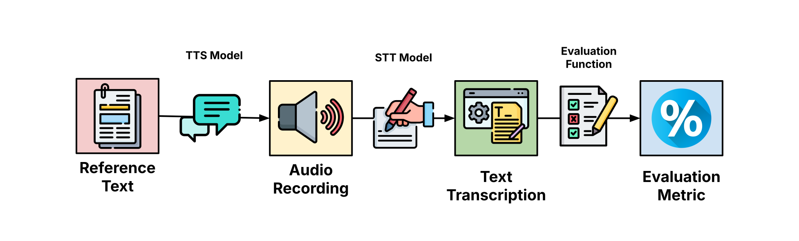
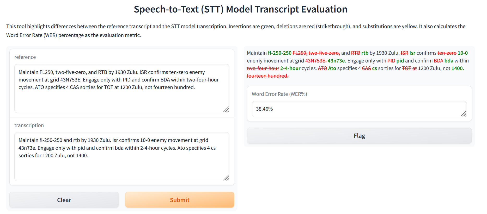
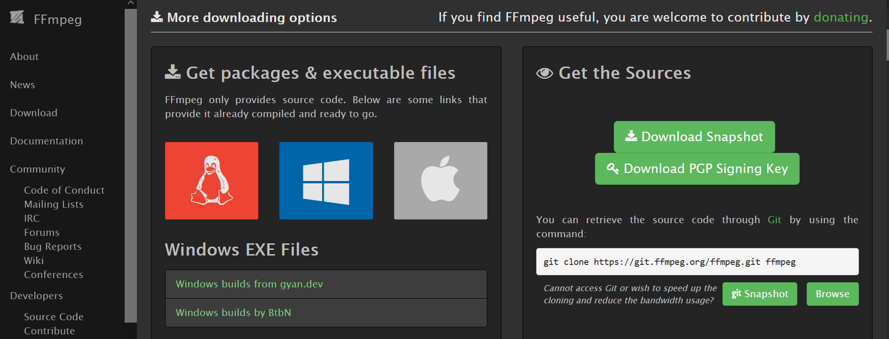

# stt_evaluate: Comparing Speech-to-Text Model Performance



The **stt_evaluate** pipeline evaluates speech-to-text model performances with the following pipeline:

1. Source a reference text. For example, this can be an aerial mission planning worksheet.
2. Convert a reference text to 16kHz `.wav` audio using OpenAI Text-to-Speech (TTS).
3. Select an Speech-to-Text (STT) model to convert the audio to a text transcription. 
4. Run an evaluation function between the **reference** text and the **transcription** text.
5. Calculate the evaluation metric (e.g., WER%, LLM Comparison)

You can interactively compare reference text with transcription text with the built-in Gradio app for Step 5, should you choose to prefer that.

```
python highlight_stt.py
```



## Environment Set-Up

The evaluation tests were run on `conda` with Python 3.10.

```
conda create -n your_env_name python=3.10
conda activate your_env_name
```

The requirements can then be installed as expected.
```
cd src
pip install -r requirements.txt
```

Note that for audio file processing, you need to download [ffmpeg](https://www.ffmpeg.org/download.html). Otherwise, you'll run into issues loading audio files with `torchaudio`.



After you download from **Get packages & executable files** (whether it be Windows, Linux, or Mac), you have to add `ffmpeg.exe` into your environment PATH. The filepath should look something like this:

```
C:\Your_User_Here\My_Folder\ffmpeg\bin
```

You can verify if FFMPEG was correctly installed by running this line in your command prompt without seeing any filepath error messages:
```
ffmpeg -version
```

## Featured Models

This repository evaluates speech-to-text model performances against one another. Currently, the repository compares:

- [moonshine-base](https://huggingface.co/UsefulSensors/moonshine-base)
- [whisper-base.en](https://huggingface.co/openai/whisper-base.en)
- [whisper-tiny.en](https://huggingface.co/openai/whisper-tiny.en)

## File Navigation

- [archive](archive/)
  - Old code/tests that aren't used anymore. Feel free to explore them
- [flagged](src/flagged/)
  - Contains user-flagged responses from the Gradio app. Think of these as special messages saved by the user (i.e., you) because of some significance (e.g., missing acronym, odd word substitution, etc.)
- [images](src/images/)
  - Images used for the README.md in this repository.
- [src](src/)
  - Contains active code used for tests
  - [audio](src/audio/)
    - Contains all audio files used to evaluate STT models.
    - [16kHz](src/audio/16kHz/)
      - Contains `.wav` files sampled at 16kHz. Whisper and Moonshine requires input audio to be set to this frequency.
    - [24kHz](src/audio/24kHz/)
      - Contains `.wav` files generated at 24kHz. OpenAI TTS model default frequency.
    - [chunk](src/audio/chunk/)
      - Stores the Greece/Persia transcript audio into 30-second chunks. Using longer audio files are incompatible with Whisper.
  - [graphs](src/graphs/)
    - Source code for `matplotlib` graphs commonly featured on my presentation slides.
  - [llm_judge](src/llm_judge/)
    - Evaluation metric that compares STT model performance using an LLM judge
    - The following folders are cached LLM evaluation results for STT transcripts using...
    - [jargon](src/llm_judge/jargon/)
      - ... a jargon dictionary
    - [metaprompt](src/llm_judge/metaprompt)
      - ... metaprompting
    - [raw](src/llm_judge/raw)
      - ... neither a jargon dictionary nor metaprompting (hence the name, raw)
    - [llm_judge_helper.py](src/llm_judge/llm_judge_helper.py)
      - Helper functions for evaluating STT trancripts using an LLM judge
    - [run_llm_XYZ.py](src/llm_judge/)
      - Script that creates the **XYZ** subfolder for cached evaluation results
  - [make_transcripts](src/make_transcripts/)
    - Creates [transcripts](src/transcripts) using a TTS model. Outputs in the [audio](src/audio/) folder. Helpful if you want to create an audio file from a long text file.
  - [transcripts](src/transcripts/)
    - Features transcript messages stored as `.txt` files.
    - Each line of a `.txt` file is converted into a stand-alone `.wav` file stored in the [audio](src/audio/) folder.
  - [wer](src/wer/)
    - Evaluation metric that compares STT model performance using WER%
  - [text_to_speech.py](src/text_to_speech.py)
    - Generates `.wav` files at 16kHz from input text. Useful for generating aircraft mission audio. Requires an OpenAPI key.
- [highlight_stt.py](highlight_stt.py)
  - Gradio app that interactively compares reference text with the STT transcription by WER%. Green = inserted, red = deleted, yellow = substituted words by the STT.
- [requirements.txt](requirements.txt)
  - Required libraries for running on Python 3.10